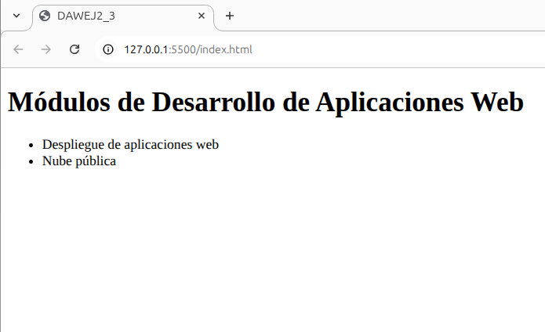

# dawEj2_3 - _Practica de GIT_

## Desarrollo de Aplicaciones Web - [Ies Salvador Gadea](https://portal.edu.gva.es/iessalvadorgadea/)

### Módulos varios:
* **_Despliegue de aplicaciones web_**
* **_Nube pública_**
* **_Diseño de interfaces_**

### Imágen del indexHTML:
---


### Código del indexHTML
---

```
<!DOCTYPE html>
<html lang="es">
<head>
    <meta charset="UTF-8">
    <title>Práctica Git - DAW</title>
</head>
<body>
    <h1>Módulos de Desarrollo de Aplicaciones Web</h1>
    <ul>
        <li>Despliegue de aplicaciones web</li>
        <li>Nube pública</li>
        <li>Diseño de interfaces</li>
    </ul>
</body>
</html>
```
